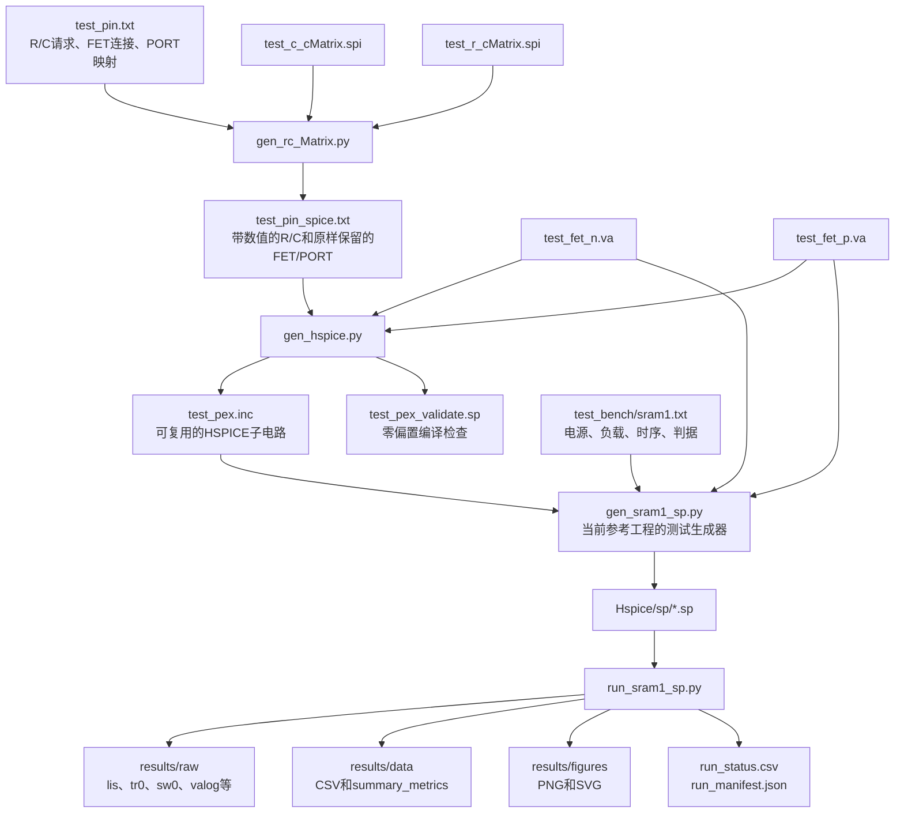

```mermaid
flowchart TD
    PIN["test_pin.txt<br/>R/C请求、FET连接、PORT映射"]
    CMAT["test_c_cMatrix.spi"]
    RMAT["test_r_cMatrix.spi"]

    PIN --> RCGEN["gen_rc_Matrix.py"]
    CMAT --> RCGEN
    RMAT --> RCGEN

    RCGEN --> PINRC["test_pin_spice.txt<br/>带数值的R/C和原样保留的FET/PORT"]

    NVA["test_fet_n.va"] --> INCGEN["gen_hspice.py"]
    PVA["test_fet_p.va"] --> INCGEN
    PINRC --> INCGEN

    INCGEN --> INC["test_pex.inc<br/>可复用的HSPICE子电路"]
    INCGEN --> VALIDATE["test_pex_validate.sp<br/>零偏置编译检查"]

    INC --> DECKGEN["gen_sram1_sp.py<br/>当前参考工程的测试生成器"]
    NVA --> DECKGEN
    PVA --> DECKGEN
    BENCH["test_bench/sram1.txt<br/>电源、负载、时序、判据"] --> DECKGEN

    DECKGEN --> DECKS["Hspice/sp/*.sp"]
    DECKS --> RUNNER["run_sram1_sp.py"]
    RUNNER --> RAW["results/raw<br/>lis、tr0、sw0、valog等"]
    RUNNER --> DATA["results/data<br/>CSV和summary_metrics"]
    RUNNER --> FIG["results/figures<br/>PNG和SVG"]
    RUNNER --> STATUS["run_status.csv<br/>run_manifest.json"]
```